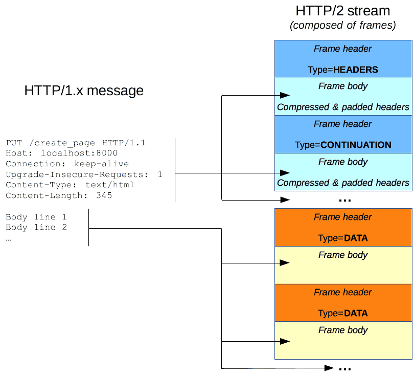

# HTTP Messages

In `HTTP/1.1` and earlier versions of the protocol, messages were openly sent across the connection.

The structure of requests and responses are generally similar. They both have:

1. Start-line  
2. An optional set of HTTP headers
3. A blank line
4. An optional body


<br>

## HTTP Requests
Are messages sent by the client to initiate an action on the server. 

### Start line
1. An HTTP method: `GET`, `PUT`, `POST`, `HEAD`, `OPTIONS`, etc.
2. The request target, a URL or absolute path:
3. The HTTP version
```
GET /background.png HTTP/1.0
HEAD /test.html?query=alibaba HTTP/1.1
```
<br>

### Headers
Is a case-insensitive string followed by a colon (`:`) and a value.

There are numerous request headers available which can be divided in several groups:

1. **General headers**
2. **Request headers**
3. **Entity headers**


<br>

### Body
Some requests send data to the server in order to update it. Not all requests have one (i.e `GET`, `HEAD`, `DELETE`, or `OPTIONS`).

```
POST /test/demo_form.php HTTP/1.1
Host: w3schools.com
name1=value1&name2=value2
```
```
POST /api/2.2/auth/signin HTTP/1.1
HOST: my-server
Content-Type:text/xml

<tsRequest>
  <credentials name="administrator" password="passw0rd">
    <site contentUrl="" />
  </credentials>
</tsRequest>
```
```
POST /api/2.2/auth/signin HTTP/1.1
HOST: my-server
Content-Type:application/json
Accept:application/json

{
  "credentials": {
    "name": "administrator",
    "password": "passw0rd",
    "site": {
      "contentUrl": ""
    }
  }
}

```

<br>

## HTTP Responses

### Status line
Consist of:
1. The protocol version, usually `HTTP/1.1`
2. A status code, indicating success or failure of the request. (i.e `200`, `404`, or `302`)
3. A status text

```
HTTP/1.1 404 Not Found.
```

<br>

### Headers
A case-insensitive string followed by a colon (`:`) and a value.


<br>

### Body
Not all responses have one (i.e. `201 Created` or `204 No Content`).

```
HTTP/1.1 200 OK
Date: Mon, 27 Jul 2009 12:28:53 GMT
Server: Apache/2.2.14 (Win32)
Last-Modified: Wed, 22 Jul 2009 19:15:56 GMT
Content-Length: 88
Content-Type: text/html
Connection: Closed

<html>
<body>
<h1>Hello, World!</h1>
</body>
</html>
```

<br>

## HTTP/2 Frames

HTTP/1.x messages have a few drawbacks for performance:

- Headers, unlike bodies, are uncompressed.
- Headers are often very similar from one message to the next one, yet still repeated across connections.
- No multiplexing can be done. Several connections need opening on the same server: and warm TCP connections are more efficient than cold ones.

HTTP/2 divides HTTP/1.x messages into frames which are embedded in a stream.<br>
Data and header frames are separated, this allows header compression.<br>
Several streams can be combined together, a process called multiplexing, allowing more efficient underlying TCP connections.

